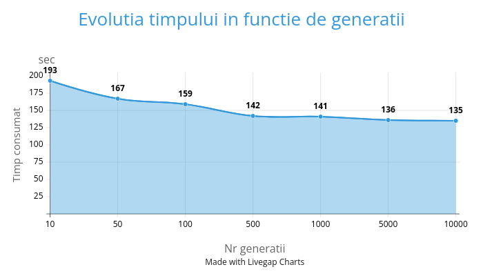

# **Algoritm genetic ce analizeaza cea mai buna organizare a urcarii in avion**
## Algoritm genetic
>***Algoritmele genetice*** functioneaza similar cu evolutia speciilor, incepand de la anumite valori sau anumite gene, cele care aduc rezultatele cele mai bune '*supravietuiesc*', generatie dupa generatie genele bune se propaga iar cele proaste mor.\
>>Cele mai bune gene sufera mutati astfel incat valorile sa poata fi schimbate pe parcursul generatiilor, dar sa pastreze majoritatea particularitatilor bune a indivizilor bune  
## Genele algoritmului
#### ***Genele*** acestui algoritm sau variabilele ce se schimba si se perfectioneaza de-a lungul generatiilor sunt:
- **Numarul grupelor**
>Numarul grupelor determina cat de sectionati sunt pasagerii ce intra in avion, seamana cu ***first-class***, ***second-class*** si ***economy***
>>Aceste grupe intra in acelasi timp, dar pasagerii dintr-o grupa intra intr-o ordine aleatoare
- **Permutarea grupelor**
>Permutarea grupelor determina ordinea in care intra grupele
>>Spre exemplu daca exista 3 grupe: 1,2,3 cele 3 grupe pot intra sub forma 1-2-3,1-3-2,2-1-3,2-3-1,3-1-2,3-2-1
- **Continutul grupelor**
>Poate cea mai importanta gena este organizarea pasagerilor in grupe
>>Ex:\
>>1 poate contine 10 pasageri (1A,4C,7F,9B,13A,14G...=>acestea sunt pozitii in avion)
## **Cum functioneaza?**
#### Organizarea datelor
1. **Pasagerii**
>*Pasagerii* sunt definiti de:
>>- ***Grupa*** este definita drept un numar ce reprezinta indicele categoriei in care pasagerul se incadreaza
>>- ***Plasamentul*** e definit de ***rand*** si ***scaunul*** pe care se afla
>>>**Planul avionului**\
>>>1A 1B 1C | | 1D 1E 1F\
>>>2A 2B 2C | | 2D 2E 2F\
>>>3A 3B 3C | | 3D 3E 3F\
>>>......................................
>>- ***Timpul ocupat*** este un numar de secunde consumate pana pasagerul isi pune bagajele, scoate ce are nevoie si se pune pe scaun si variaza de la pasager la pasager
```rs
#[derive(Debug,Clone,Copy)]
struct Passanger{
    group:i32,
    placement:(i32,char),
    time_ocuppied:i32
}
```
2. **Grupa**
>*Grupurile* sunt definite de:
>>- ***Id*** 
>>- ***Sir de pasageri*** pe care grupa le contine
```rs
#[derive(Debug,Clone)]
struct Group{
    id:i32,
    passangers:Vec<Passanger>
}
```
3. **Avion**
>*Avioanele* sunt definte de:
>>- ***Sir de grupuri***
>>- ***Permutarea grupelor*** (explicata mai devreme)
>>- ***Rezultatul***=> cat dureaza ca toti pasagerii sa ajunga in locul lor
```rs
struct Plane{
    group:Vec<Group>,
    permutare_grupe:Vec<i32>,
    result:i32
}
```
### Functiile structurilor
1. **Crearea unui pasager nou**
>*Pasagerii* sunt creati stiind grupul in care se afla si pozitia pe care o are, timpul pe care un pasager il consuma este ales *random*
```rs
Passanger::new(group:i32,placement:(i32,char))
```
2. **Crearea unui grup nou**
>*Grupurile* sunt create fara informatie aditionala sub forma lor **default**
>>Default:\
>>```id=0```\
>>```pasangeri=lista de pasageri cu 0 elemente```
```rs
let group=Group::new();
println!("{:?}",group);
```
>Output
```bash
{id:0, passangers: []}
```
3. **Initializarea avionului**
>*Avionul* este creat stiind nr de grupe pe care le contine sub forma sa **default**
>>Default:\
>>```group=sir de grupuri de tip default```\
>>```permutare_grupe=o permutare random a sirulul 1,2,3..nr_grupe```\
>>```result=0```
```rs
Plane::initialise(nr_groups:i32)
```
4. **Configurarea avionului**
```rs
plane.add_config(nr_groups);
```
>Avionul, Grupele si Pasageri primesc valori random
```rs
fn add_config(&mut self,nr_groups:i32){
        let mut passanger_per_group=vec![ROW_LENGHT*PLANE_ROWS/nr_groups as usize;nr_groups as usize];
        passanger_per_group[get_random(0, nr_groups-1) as usize]+=ROW_LENGHT*PLANE_ROWS%nr_groups as usize;
        // Vectorul passanger_per_group tine cati pasageri ar trebui sa aiba fiecare grupa pentru a le echilibra


        for i in 0..nr_groups{
            self.group[i as usize].id=i+1;
        }
        // Se pun id-urile grupelor

        //Se parcurg toate locurile din avion
        for i in 1..=PLANE_ROWS{
            for j in 1..=ROW_LENGHT{
                let mut random_group=get_random(1, nr_groups);
                while passanger_per_group[random_group as usize-1]==0{
                    random_group=get_random(1, nr_groups);
                }
                passanger_per_group[random_group as usize-1]-=1;
                let pasanger=Passanger::new(random_group, (i as i32,to_letter(j as i32)));
                self.group[pasanger.group as usize-1].passangers.push(pasanger);
            }
        }
    }
```
>Algoritmul trece prin fiecare scaun al avionului si ii atribuie o grupa
5. **Afisarea avionului**
```rs
plane.show();
```
>*Avionul* este afisat sub forma:\
x y z | | a b c\
a x b | | a b x\
........................\
Result:......\
>Unde a,b,c,x,y,z,etc.. sunt indexele unor grupuri
>>Ex:
```bash
 1 1 2 | | 3 2 2
 2 2 1 | | 3 1 3
 4 1 2 | | 2 1 4
 2 3 1 | | 4 1 1

Result:114 sec
```
## Constante ale programului
>Constantele au fost alese dupa un avion mai mic
- **Numarul de randuri**
```rs
const PLANE_ROWS:usize=20;
```
- **Numarul de scaune pe un rand**
```rs
const ROW_LENGHT:usize=6;
```
- **Maximul si Minimul pe care un pasager poate sa-l consume inainte sa se aseze**
```rs
const WAIT_TIME_MAX:i32=15;
const WAIT_TIME_MIN:i32=5;
```
- **Timpul care se adauga cand alti pasageri trebuie sa se ridice pentru a te aseza**
```rs
const WAIT_ADD_ON_FAR_FROM_SEAT:i32=15;
```
- **Timpul consumat pentru a ajunge la urmatorul rand**
```rs
const MOVE_DELAY:i32=2;
```
- **Numarul maxim de grupuri**
```rs
const UPPER_LIMIT_GROUPS:i32=10;
```
- **Numarul maxim de schimbari intr-o mutatie**
```rs
const MAX_CHANGE_IN_MUTATIONS:i32=20;
```
- **Constantele algoritmului genetic**
>- **Diversitatea genetica**
>>Descrie cate avioane sunt testate in fiecare generatie

>- **Supravietuitori/Parintii**
>> Descrie numarul de avioane ce supravietuiesc in fiecare generatie si devin parintii urmatoarei
>- **Numarul de generatii** 
```rs
const GENETIC_DIVERSITY:usize=1000;
const BEST_CHOSEN:usize=100;
const NUMBER_OF_GENERATIONS:i32=1000;
```
## Functii ajutatoare
- **get_random(limita la stanga, limita la dreapta)**
>Returneaza un nr in intervalul dat
```rs
fn get_random(limit_st:i32,limit_dr:i32)->i32{
    let mut rng=rand::thread_rng();
    if limit_st==limit_dr{
        return limit_dr;
    }
    else if limit_st>limit_dr {
        panic!("Invalid");
    }
    rng.gen_range(limit_st..=limit_dr)
}
```
- **get_random_permutation(vector de elemente)**
>Returneaza o permutare a vectorului dat
```rs
fn get_random_permutation<T:Clone>(original:&Vec<T>)->Vec<T>{
    let lenght=original.len();
    let mut permutation:Vec<T>=original.clone();
    for i in 0..lenght{
        permutation.swap(i, get_random(0, lenght as i32-1) as usize);
    }
    permutation
}
```
- **to_letter(number) si to_number(letter)**
> Transforma din char in numar-(char)<=>(i32)
>>Ex:\
>> 'A'<=>1\
>> 'B'<=>2\
>>etc..
```rs
fn to_letter(num:i32)->char{
    char::from_u32(u32::try_from('A').unwrap()+num as u32-1).expect("Cannot convert i32 to letter")
}


fn to_number(letter:char)->i32{
    (u32::try_from(letter).unwrap()-u32::try_from('A').unwrap()) as i32+1
}
```
- **binary_search((inceput,final),vector,valoare)**
>Cauta pozitia unui avion intr-un vector de avioane in functie de rezultat *(timpul consumat pana toti pasagerii se aseaza)* si returneaza pozitia in vector
```rs
let nr_groups=4;
let plane=Plane::initialize(nr_groups);
plane.result=100;//secunde
let position:usize=binary_search((0,plane_array.len()),plane_array,plane.result);
```
>Implementarea recursiva a cautarii binare in ***Rust***
```rs
fn binary_search(mut range:(usize,usize),v:&Vec<Plane>,my_result:i32)->usize{
    if range.0<=range.1{
        let mid=(range.0+range.1)/2;
        if v[mid].result<my_result{
            range.0=mid+1;
        }
        else if mid>0{
            range.1=mid-1;
        }
        else{
            return 0;
        }
        binary_search(range, v, my_result)
    }
    else{
        range.0
    }
}
```
- **get_top_performers(results)**
>Returneaza un vector de lungime ***BEST_CHOSEN*** corespunzator celor mai bune avioane dintr-un vector de lungime ***GENETIC_DIVERSITY*** din punct de vedere a **rezultatelor** 
```rs
fn get_top_performers(results:&Vec<Plane>)->Vec<Plane>{
    let mut top:Vec<Plane>=Vec::new();
    top.push(results[0].clone());
    while top.len()<BEST_CHOSEN{
        let position=binary_search((0,top.len()-1), &top,results[top.len()].result);
        if position<top.len(){
            top.insert(position, results[top.len()].clone());
        }
        else{
            top.push(results[top.len()].clone());
        }
    }


// Pana cand vectorul nou se umple pana la lungimea de BEST_CHOSEN
// valorile din vectorul initial sunt impinse la final daca au cel mai prost rezultat.
// Altfel sunt inserate in pozitia determinata de cautarea binara


    for i in top.len()..results.len(){
        top.insert(binary_search((0,top.len()-1), &top, results[i].result), results[i].clone());
        top.split_off(BEST_CHOSEN).clear();
    }
    top
}
```
> Din momentul in care vectorul ajunge la marimea maxima, orice valoare este inserata si cea mai proasta valoare este extrasa ramanand cu cele mai bune **BEST_CHOSEN** configuratii de avioane
## Mutatiile configuratiilor de avioane
>Dupa ce sunt alese cele mai bune configuratii acestea sufera mutatii de trei tipuri
```rs
    let mutation_count:usize=GENETIC_DIVERSITY/BEST_CHOSEN;
    let group_permutation=mutation_count/3;
    //Daca nr de grupe nu depaseste limita
    let group_add:usize={
        if plane.group.len()<UPPER_LIMIT_GROUPS as usize{
            mutation_count/3
        }
        else{
            0
        }
    };
    let group_switch:usize=mutation_count-group_permutation-group_add;
    //Lista de mutati rezultate din avionul original
    let mut mutations:Vec<Plane>=Vec::new();
```
>Fiecare configuratie va suferii **GENETIC_DIVERSITY/BEST_CHOSEN** mutatii pentru a pastra un total de **GENETIC_DIVERSITY** indivizi intr-o generatie\
>Toate mutatiile sunt puse intr-un vector nou numit **mutations**\
> Acestea sunt impartite in 3:
>>- **Permutarea grupelor**
>>> Ordinea in care grupele intra in avion poate suferi o schimbare intre doua grupuri
>>>```rs
>>>for _ in 0..group_permutation{
>>>     let mut new_plane=plane.clone();
>>>
>>>     //se aleg grupe random schimbate
>>>     let x=get_random(0, plane.permutare_grupe.len() as i32-1);
>>>     let y=get_random(0, plane.permutare_grupe.len() as i32-1);
>>>
>>>     //se face schimbul 
>>>     new_plane.permutare_grupe.swap(x as usize, y as usize);
>>>     mutations.push(new_plane);
>>> }
>>>```
>>- **Adaugarea unei noi grupe**
>>>Se adauga o grupa noua pe langa cele existente ce preia un numar determinat de pasageri de la celelalte grupe pentru a pastra un echilibru intre numarul de pasageri ale fiecareia
>>>```rs
>>>for _ in 0..group_add{
>>>     let mut new_plane=plane.clone();
>>>
>>>     //se introduce un grup nou in avion
>>>     new_plane.group.push(Group { id: plane.group.len() as i32+1, passangers: Vec::new()});
>>>     new_plane.permutare_grupe.push(plane.group.len() as i32+1);
>>>
>>>     //se determina un numar de pasageri furati de la fiecare grupa ce nu poate fi 0
>>>     let passagers_stolen_count=((ROW_LENGHT*PLANE_ROWS) as f64/((plane.group.len()*(plane.group.len()+1)*plane.group.len()) as f64)).ceil() as usize;
>>>
>>>     for i in 0..plane.group.len(){
>>>         for __ in 0..passagers_stolen_count{
>>>             //se alege un pasager random ce se extrage dintr-o grupa si e adaugat in cea noua
>>>             let random_passanger_iter=get_random(0, new_plane.group[i].passangers.len() as i32-1) as usize;
>>>             let passanger=new_plane.group[i].passangers.remove(random_passanger_iter);
>>>
>>>             new_plane.group.last_mut().unwrap().passangers.push(passanger);
>>>         }
>>>     }
>>>
>>>     mutations.push(new_plane);
>>> }
>>>```
>>- **Schimbarea pasagerilor intre grupe**
>>> Un numar random de pasageri pot schimba grupa din care fac parte 
>>>```rs
>>> for _ in 0..group_switch{
>>>     // se determina un nr random de schimbari intre 0 si maxim
>>>     let number_of_changes=get_random(0, MAX_CHANGE_IN_MUTATIONS);
>>>
>>>     let mut new_plane=plane.clone();
>>>     for __ in 0..number_of_changes{
>>>
>>>         //se aleg doua grupe random
>>>         let  group1=get_random(0, plane.group.len() as i32-1) as usize;
>>>         let  group2=get_random(0, plane.group.len() as i32-1) as usize;
>>>
>>>         //se aleg doi pasageri random din acele grupe
>>>         let x=get_random(0, new_plane.group[group1].passangers.len() as i32-1) as usize;
>>>         let y=get_random(0, new_plane.group[group2].passangers.len() as i32-1) as usize;
>>>         let passanger1=new_plane.group[group1].passangers[x].clone();
>>>         let passanger2=new_plane.group[group2].passangers[y].clone();
>>>
>>>         //interschimbarea
>>>         {
>>>             new_plane.group[group2].passangers[y]=passanger1;
>>>             new_plane.group[group1].passangers[x]=passanger2;
>>>         }
>>>     }
>>>     mutations.push(new_plane);
>>> }
>>>```
## Timpul consumat pana urcarea in avion
#### Cum functioneaza?
> Pentru a nu parcurge fiecare secunda pana ultimul pasager ajunge in locul sau, putem tine un vector desemnat coridorului ce pastreaza momentele in care un anumit rand al coridorului este ocupat
>>Pentru asta am folosit un *struct* nou:
>>```rs
>>#[derive(Clone)]
>>struct Ocupation{
>>    period:Vec<(i32,i32)>
>>}
>>```
>>Acesta tine un vector de tuple-uri ce reprezinta un sir de perioade\
>>>Ex:\
>>>(2,3),(5,7),(10,20),(24,26),.....\
>>>Asta arata ca acest loc a fost ocupat in perioadele de la 2-3, 5-7, 10-20, 24-26...

>>Structura are cateva functi:
>>- new()
>>>Creaza o variabila **Ocupation** cu vectorul **period** avand 0 elemente
>>```rs
>>let ocup=Ocupation::new();
>>println!("{:?}");
>>```
>>Output:
>>```bash
>>{ period:[] }
>>```
>>- contains(moment)
>>>Verifica daca un anumit moment este ocupat in acel loc, iar daca este=> returneaza perioada in care se incadreaza, altfel returneaza *None*
>>>```rs
>>>let ocup=Ocupation::new();
>>>ocup.period.push((10,20));
>>>let x:(i32,i32)=ocup.contains(21);// returneaza None
>>>let y:(i32,i32)=ocup.contains(20);//returneaza (10,20)
>>>```
>Codul insusi analizeaza fiecare rand prin care fiecare pasager intra pentru a vedea daca:
>- Pasagerul a ajuns in locul sau
>>In cazul acesta daca spre exemplu pasagerul trebuie sa se duca la pozitia 10F si e deja cineva pe pozitia 10E, el trebui sa astepte ca acesta sa se ridice pentru a se pune\
>>\
>>Altfel pasagerul se poate pune linisitit fara sa astepte alte persoane. Astea fiind spuse pasagerul la randul sau consuma anumit timp pana isi pune bagajul, isi scoate ce are nevoie etc..., timp determinat mai devreme
>- Pasagerul nu a ajuns in locul sau si vrea sa continue miscarea:
>>Cazul acesta se impare in doua:
>>>- Pasagerul poate merge in fata\
>>> In acest caz pasagerul pur si simplu va consuma doar timpul ce ii ia sa mearga pana la randul urmator
>>>- Pasagerul nu poate merge in fata\
>>>In acest caz pasagerul va astepta pana cand randul din fata sa se elibereaza si apoi continua miscarea
```rs
fn get_time_spent(plane:&mut Plane)->i32{

    let mut total_time:i32=0;

    //locurile in avion=>pentru verificare daca trebuie sa se ridice oamenii
    let mut  plane_matrix:Vec<Vec<Option<Passanger>>>=vec![vec![None;ROW_LENGHT];PLANE_ROWS+1];
    
    //passageri ce vor intra in avion
    let mut line:Vec<Passanger>=Vec::new();

    //adaugarea pasagerilor in coada
    for group in &plane.permutare_grupe{
        let random_perm=get_random_permutation(&plane.group[*group as usize-1].passangers);
        for passanger in  random_perm{
            line.push(passanger.clone());
        }
    }

    //contine locurile de pe coridor si in ce momente sunt ocupate
    let mut coridor_wait:Vec<Ocupation>=vec![Ocupation::new();PLANE_ROWS+1];

    for passanger in line{
        //pastreaza cand a ajuns pasagerul la randul curent
        let mut time_arrive_row:i32=0;

        for i in 0..coridor_wait.len(){

            //daca pasagerul a ajuns in locul sau
            if passanger.placement.0==i as i32{

                //tine cat trebuie sa astepte pasagerul ca alte persoane sa se ridice pentru ca el sa se aseze
                //asta daca este cazul
                let time_waiting_passangers={

                    //in ce parte a avionului sta 
                    let range={
                        if to_number(passanger.placement.1)<=ROW_LENGHT as i32/2{
                            to_number(passanger.placement.1) as usize..ROW_LENGHT/2-1
                        }
                        else{
                            ROW_LENGHT/2..to_number(passanger.placement.1) as usize
                        }
                    };
                    let mut count=0;
                    for i in range{
                        if plane_matrix[passanger.placement.0 as usize][i].is_some(){
                            count+=1;
                        }
                    }
                    count*WAIT_ADD_ON_FAR_FROM_SEAT
                };

                //se adauga perioada pe care pasagerul o consuma pentru a se pune la loc
                coridor_wait[i].period.push((time_arrive_row,time_arrive_row+passanger.time_ocuppied+time_waiting_passangers));

                //se verifica daca timpul pana pasagerul s-a pus este cel maxim
                total_time=std::cmp::max(total_time, time_arrive_row+passanger.time_ocuppied+time_waiting_passangers);

                //se tine faptul ca pasagerul a ajuns la locul sau
                plane_matrix[passanger.placement.0 as usize][to_number(passanger.placement.1) as usize-1]=Some(passanger);
                break;
            }

            //daca pasagerul nu e pe linia randului sau verificam daca poate merge in fata
            else{ 
                let end=coridor_wait[i+1].contains(time_arrive_row+MOVE_DELAY);
                match end {
                    
                    //in cazul acesta nu poate merge in fata deoarece o persoana deja ocupa locul
                    //se adauga timpul pe care il asteapta si cel dintre randuri
                    Some(period)=>{
                        coridor_wait[i].period.push(period);
                        time_arrive_row=period.1+MOVE_DELAY;
                    }

                    //altfel merge in fata normal adaugand timpul pe care il consuma mergand
                    None=>{
                        time_arrive_row+=MOVE_DELAY;
                    }
                }

            }   

        }
    }
    total_time

}
```
## Algoritmul genetic/ Functia main
>**Algoritmul** incepe prin a *crea un sir de configuratii de avioane*, iar prin *evaluarea* lor, *selectia* configuratiilor cele mai eficiente si *crearea noii generatii prin mutarea 'genelor'*, algoritmul ajunge la cea mai buna configuratie 
```rs
fn main() {
    //Indivizii primei generatii
    let mut planes_scope=vec![Plane::intialize(get_random(1, UPPER_LIMIT_GROUPS));GENETIC_DIVERSITY];

    //configurarea primei generatii
    for plane in &mut planes_scope{
        plane.add_config(plane.group.len() as i32);
    }


    for _ in 0..NUMBER_OF_GENERATIONS{

        //calcularea rezultatelor 
        for mut plane in &mut planes_scope{
            plane.result=get_time_spent(plane);        
        }

        //pastrarea elementelor cu cele mai bune rezultate
        let top:Vec<Plane>=get_top_performers(&planes_scope);
        planes_scope=Vec::new();
        for top_plane in top{
            planes_scope.append(&mut mutate(top_plane))
        }
    }

    //formarea ultimei generatii
    for mut plane in &mut planes_scope{
        plane.result=get_time_spent(plane);        
    }
    let top:Vec<Plane>=get_top_performers(&planes_scope);

    //printarea celei mai bune configuratii
    println!("{:?}",top[0]);
    top[0].show();
    println!("Permuatarea Grupelor:{:?}",top[0].permutare_grupe);
    println!("Result:{}",top[0].result);
}
```
# Rezultatul experimentului
> In continuare voi evalua configuratiile date de algoritm (variand si numarul de generatii) contra celei mai bune configuratii demonstrate de oameni si contra a configuratiei folosite de majoritatea firmelor de transport aerian
>>Cea mai buna configuratie:
>>```bash
>>6 4 5 | | 3 2 1
>>1 2 3 | | 4 5 6
>>6 4 5 | | 3 2 1
>>1 2 3 | | 4 5 6
>>6 4 5 | | 3 2 1
>>1 2 3 | | 4 5 6
>>6 4 5 | | 3 2 1
>>1 2 3 | | 4 5 6
>>6 4 5 | | 3 2 1
>>1 2 3 | | 4 5 6
>>```
>>>Imbarcarea se face in ordine 1->6->2->5->3->4\
>>>\
>>>Motivul pentru care aceasta configuratie este foarte buna este faptul ca imbarca pasageri din exterior in interior dar totodata lasa o distanta de 2 randuri intre membri aceleiasi grupe pentru a interfera cat mai putin uni cu altii\
>>>\
>>>Merita mentionat ca desi majoritatea firmelor de avioane organizeaza din spate spre fata, metoda de a urca pasageri random este aprope lafel de optima ca orice alta configuratie si chiar mai buna per total decat metoda **back-to-front**
### Metoda Back-to-Front vs Algoritmul genetic


> Pe langa faptul ca precum vedem pe grafic, configuratia algoritmului cu doar 100 de generatii, pe langa faptul ca are o performanta mai buna, are una mul mai stabila

### Performanta algoritmului in functie de numarul de generatii


> Dupa cum vedem dupa 500 de generatii timpul aproximativ stationeaza\
>\
> Cand algoritmul trebuie sa ruleze 10 000 de generatii dureaza aprox. o ora si da cel mai bun rezultat:
>>```bash
>>3 3 2  1 2 2 
>>1 2 2  2 3 3 
>>2 1 3  3 2 1 
>>2 3 3  3 3 3 
>>1 3 2  3 2 2 
>>3 2 2  3 3 2 
>>2 3 3  2 1 3 
>>2 3 1  2 1 2 
>>3 2 3  2 2 2 
>>1 2 3  2 3 3 
>>1 1 1  1 3 2 
>>3 3 1  1 1 2 
>>3 2 1  2 3 1 
>>1 1 1  3 1 3 
>>3 3 3  2 3 1 
>>1 1 2  1 3 3 
>>2 3 1  3 2 1 
>>1 1 2  2 1 1 
>>1 2 1  2 1 1 
>>1 2 2  1 1 1 
>>Permuatarea Grupelor:[1, 2, 3]
>>Result:135
>>```

## Concluzie 
In concluzie desi algoritmul nu aduce configuratia perfecta, aduce una remarcabil de buna si mult peste configuratiile **random** sau ***back-to-front*** 


